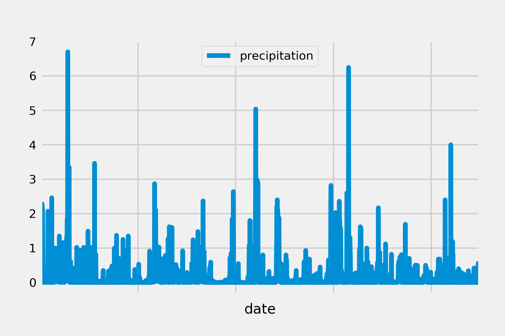
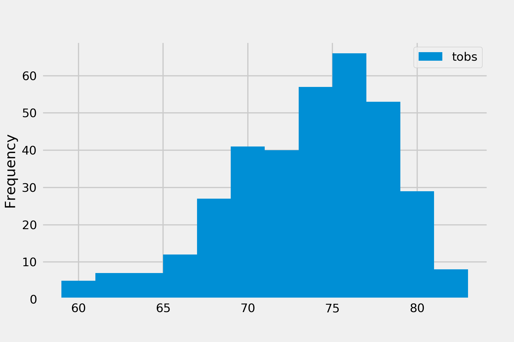
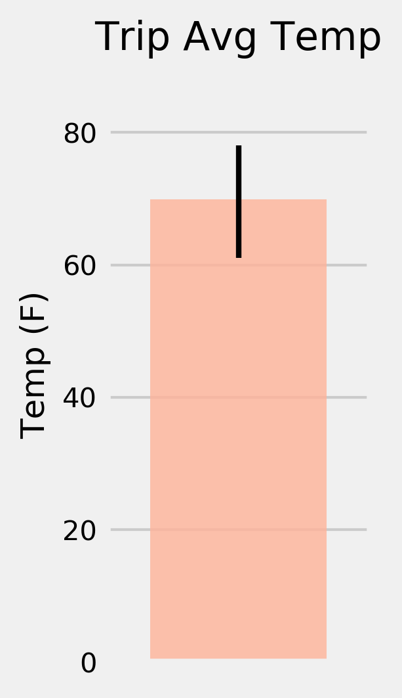
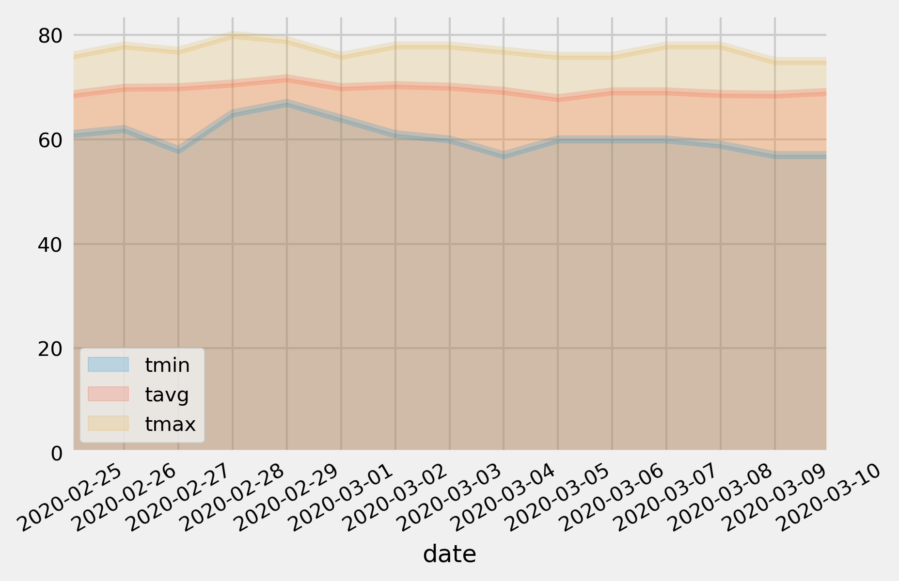
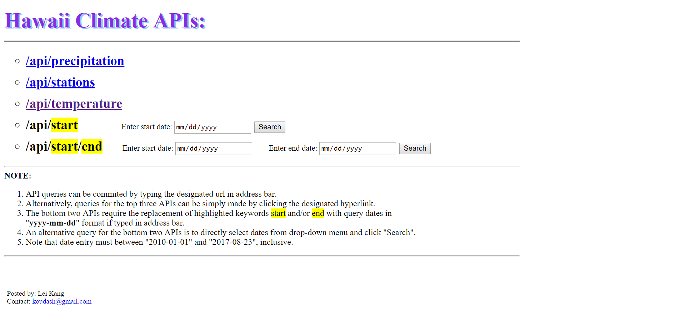

# Surfs-up-Hawaii!

<strong>Ready for a trip to Hawaii? Better check the weather there before you go!</strong>

<code>Python</code> and <code>SQLAlchemy</code> were used to reflect tables from sqlite database files into SQLAlchemy ORM, to which queries were made with exploratory analysis on Hawaii climate being performed using <code>Pandas</code> library.
  

Parameters taken into consideration were <em>precipitation in the latest 12 months</em>, <em>temperature recorded by the most active observation station</em>, <em>estimated average temperature for planned trip</em>, and <em>estimated daily normal temperatures for planned trip</em>. Results were visualized by <code>Matplotlib</code> as follows.

<strong>Precipitation in the latest 12 months:</strong>

<strong>Temperature recorded by the most active observation station:</strong>

<strong>Estimated average temperature for planned trip:</strong>

<strong>Estimated daily normal temperatures for planned trip:</strong>

Moreover, Flask API server was developed upon the aforementioned sqlite database files. Inqueries from customer and data returning thereafter were interfaced through HTML.

